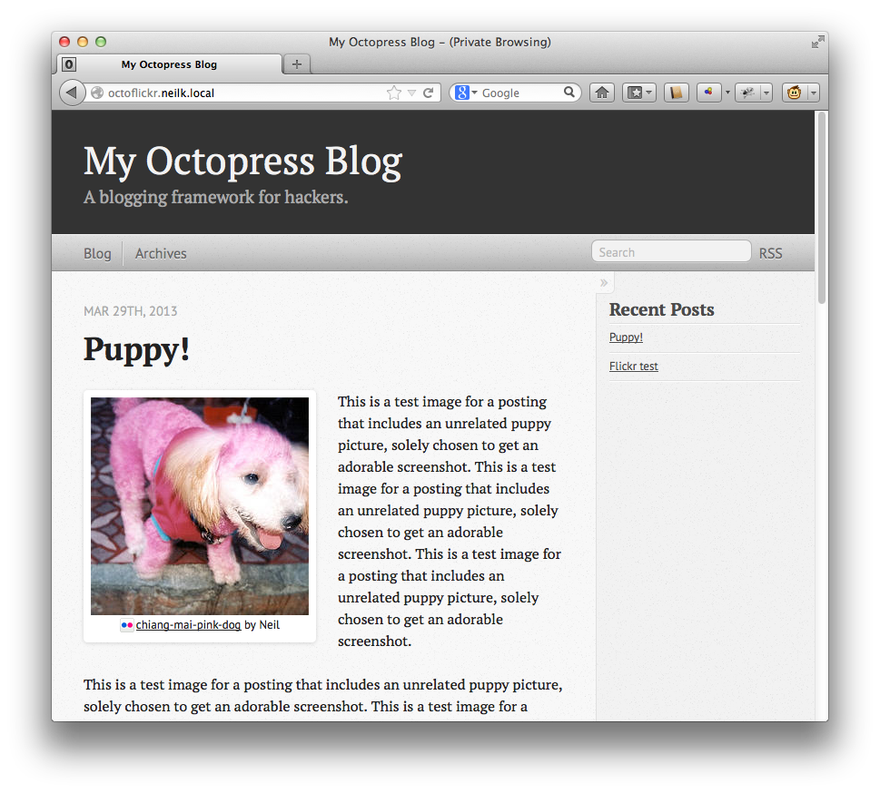
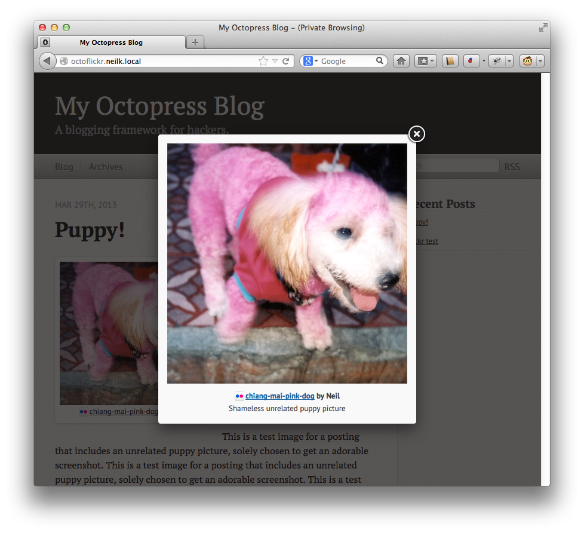
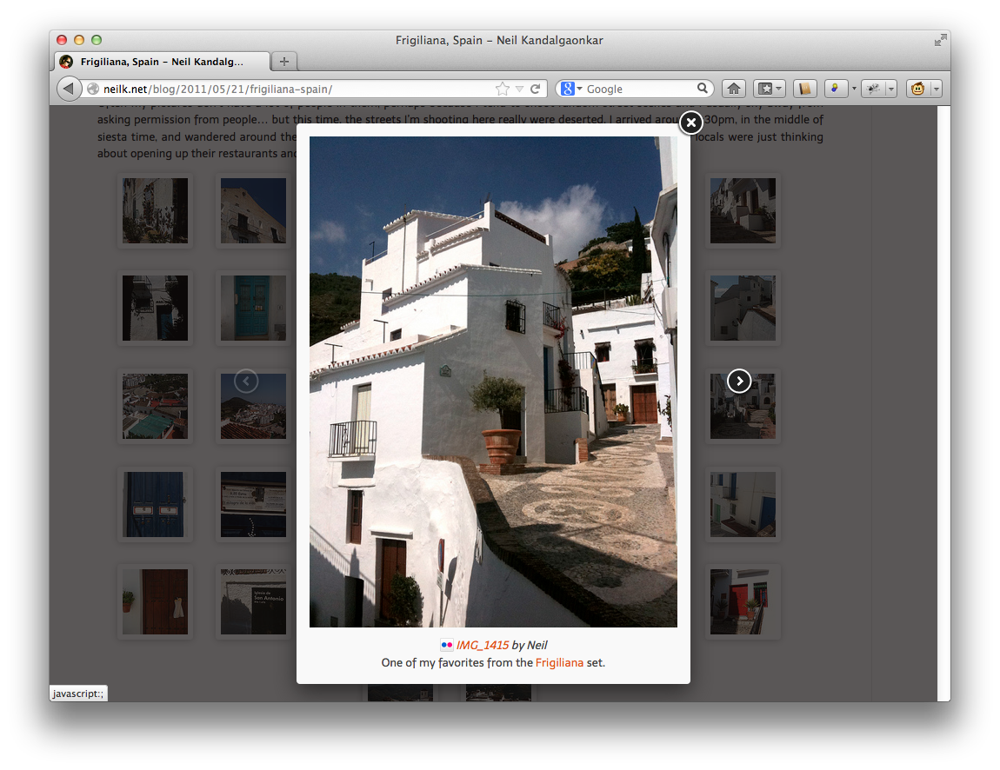

octopress-flickr
================

Display Flickr images, video, and sets in Octopress blog posts.

This does not use JavaScript in the browser to insert images - it generates the appropriate HTML right in the post. Screenshots:




If you use Fancybox with this plugin, you can get fancy boxes when
you click on an image or video. These will have slideshow buttons
and keystrokes enabled, if the image is part of a set.





## Examples

``` md
{% flickr_image 7779670214 }






```

## Setup

### Obtain a Flickr API key and secret

You're going to need to obtain a [Flickr API key and secret](http://www.flickr.com/services/developer/api/).

Then, you'll need to ensure that they are available in the environment variables `FLICKR_API_KEY` and `FLICKR_API_SECRET`, 
before you run `rake generate`. 

### Install the plugin

Add these dependencies to your Octopress gemfile:

``` Rakefile
  gem 'flickraw'
  gem 'builder', '> 2.0.0'
  gem 'persistent_memoize'
```

And do a `gem install` from that directory.

Clone or otherwise obtain the files in this repository on your system. Copy the `.rb` and `.scss` files into
the corresponding directories in your Octopress instance.

Aaand, you're done. You can start using the new tags right away. (But, see below for how to install Fancybox,
which will greatly improve the UI)

## How to use the tags in your blog

This plugin adds two new tags to your Octopress install. Use `flickr_image` to insert a specific image or video. 
Use `flickr_set` to insert an entire set. The arguments for these tags are:

``` md
  

  
```

On Flickr, the **id** of the image is easily obtained from the URL. In this case the id is '3696071951'.

    http://www.flickr.com/photos/someuser/3696071951

The **preview-size** must be specified as a single-letter code. Typically you will only need to remember that `m` is medium size,
and `z` will probably fill the entire screen. Here is the full list of sizes you can use, with their common name on Flickr,
and then the maximum width or height of that image.

* **o**  : "Original", no maximum dimension
* **b**  : "Large", 1024px
* **z**  : "Medium 640", 640px
* **n**  : "Small 320", 320px
* **m**  : "Small", 240px,
* **t**  : "Thumbnail", 100px
* **q**  : "Large Square", 150px
* **s**  : "Square", 75px

The **alignment** is specified as `left`, `right`, or `center`, like the rest of Octopress.

The **caption** is a freeform string. If you want to have spaces in the caption, you may escape them directly with backslashes, or simply surround 
the entire argument with quotation marks. If your caption must also contain quotation marks, escape them with backslashes.

For photo sets, the final argument is not a caption, but controls whether the set description from Flickr is prepended to the entire set.

## I updated my photos on Flickr; why aren't they updating in Octopress?

This plugin caches API results and generated HTML in a `.flickr-cache` directory in your Octopress root. This makes sure that we aren't wasting
time redownloading information from Flickr every time you update your blog. 

But, in case the information about those photos changes, to see updates, you need to remove those cache files and then `rake generate`.

At the moment it is not easy to remove the caches for some photos or sets and not others. Some command-line fu can help - this removes cache
files younger than one hour:

``` sh
find .flickr-cache/ -type f -mtime -1h | xargs rm
```

You also might want to modify your Rakefile to clean out this cache. If your Rakefile is typical, you need to change the `:clean` target to look 
like this:

``` Rakefile
desc "Clean out caches: .pygments-cache, .gist-cache, .sass-cache, .flickr-cache"
task :clean do
  rm_rf [".pygments-cache/**", ".gist-cache/**", ".sass-cache/**", "source/stylesheets/screen.css", ".flickr-cache/**"]
end
```


## Fancybox 

While this plugin can be used standalone, it is far superior with the JavaScript lightbox and slideshow library 
[Fancybox](http://fancyapps.com/fancybox/). Here's how to set it up.

First, download and uncompress [Fancybox](http://fancyapps.com/fancybox/).
In the directory which was created from uncompressing Fancybox,
copy the contents of the `source` directory to the `source/fancybox`
directory in your Octopress install. It might look like this:

``` sh
$ unzip fancyapps-fancyBox-v2.1.4-0-somehash.zip
$ cd fancyapps-fancyBox-somehash
$ cp -R source ~/Sites/myOctopressSite/source/fancybox
```

Next, in the files you downloaded from this `octopress-flickr` respository, copy the file
`source/_includes/custom/fancybox_head.html` to the corresponding directory in your Octopress install.

Next, in your Octopress install, in the file `source/_includes/head.html`, add the following line. This line should be after loading jQuery, but 
before custom/head.html.

``` markdown
 
```

Everything should work now, but you may notice that when you click on Flickr images, there's a spinner while loading, and it will 
have this ugly white border. It's doing that because it's picking up a style from your Octopress install. To fix that, change the following
lines in `sass/base/_theme.scss`.

``` diff
body {
-  > div {
+  > #main {
     border-bottom: 1px solid $page-border-bottom;
-    > div {
+    > #content {
       border-right: 1px solid $sidebar-border;
     }
   }
```

That should do it!

For efficiency, you might want to merge the CSS into the SASS system, but you're on your own there - depending on the theme of your blog, 
it will be different.

## HTML5

This plugin tries to generate standards-compliant, modern HTML5. That means it uses tags like `<figure>` and `<figcaption>` and such. This may not look right in very old browsers, 
but it seems to work in anything better than IE7. 

## Be nice

Flickr allows you to embed images in your blog, but they request you always link back to the source image. This plugin handles that for you by
default, so don't mess with it.

Obviously using your own images is fine, but be aware that you don't always have the rights to republish images on your own blog. If you want to
be sure, ask the author's permission. Or use Flickr's [advanced search](https://www.flickr.com/search/advanced/) to find [Creative Commons](https://creativecommons.org)-licensed media. 


## Acknowledgements

Originally based on [this gist](https://gist.github.com/danielres/3156265) by Daniel Reska.
