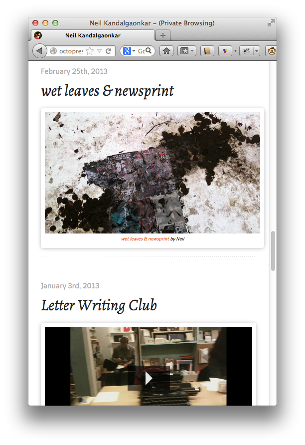

octopress-flickr
================

Display Flickr images, video, and sets in Octopress blog posts.

This does not use JavaScript in the browser to insert images - it generates the appropriate HTML right in the post. Screenshots:





## Examples

``` md
{% flickr_image 7779670214 }






```

## Install

Add these dependencies to your Octopress gemfile:

``` Rakefile
  gem 'flickraw'
  gem 'builder', '> 2.0.0'
  gem 'persistent_memoize'
```

And do a `gem install` from that directory.

Clone or otherwise obtain the files in this repository on your system. Copy the `.rb` and `.scss` files into
the corresponding directories in your Octopress instance.

### Recommended: install Fancybox

While this plugin can be used standalone, it is far superior with the JavaScript lightbox and slideshow library 
[Fancybox](http://fancyapps.com/fancybox/). Here's how to do that.

First, download and uncompress [Fancybox](http://fancyapps.com/fancybox/).
In the directory which was created from uncompressing Fancybox,
copy the contents of the `source` directory to the `source/fancybox`
directory in your Octopress install. It might look like this:

``` sh
$ unzip fancyapps-fancyBox-v2.1.4-0-somehash.zip
$ cd fancyapps-fancyBox-somehash
$ cp -R source ~/Sites/myOctopressSite/source/fancybox
```

Next, in the files you downloaded from this `octopress-flickr` respository, copy the file
`source/_includes/custom/fancybox_head.html` to the corresponding directory in your Octopress install.

Next, in your Octopress install, in the file `source/_includes/head.html`, add the following line. This line should be after loading jQuery, but 
before custom/head.html.

``` markdown
 
```

That should do it!

For efficiency, you might want to merge the CSS into the SASS system, but you're on your own there - depending on the theme of your blog, 
it will be different.

## Flickr API key and secret

You're going to need to obtain a [Flickr API key and secret](http://www.flickr.com/services/developer/api/).

Then, you'll need to ensure that they are available in the environment variables `FLICKR_API_KEY` and `FLICKR_API_SECRET`, 
before you run `rake generate`. Typically you initialize them in your `.bash_profile`. 

``` sh
# Flickr API secret
export FLICKR_API_KEY=abcdef1234567890
export FLICKR_API_SECRET=0123456789abcdef

# Optional: if you're on Mac OS X, for extra security, keep the API secret as an application password in the Keychain
# export FLICKR_API_SECRET=$(/usr/bin/security 2>&1 >/dev/null find-generic-password -ga $FLICKR_API_KEY | sed 's/password: //' | sed 's/"//g')
```

## How to use the tags in your blog

This plugin adds two new tags to your Octopress install. Use `flickr_image` to insert a specific image or video. 
Use `flickr_set` to insert an entire set. The arguments for these tags are:

``` md
  

  
```

On Flickr, the **id** of the image is easily obtained from the URL. In this case the id is '3696071951'.

    http://www.flickr.com/photos/someuser/3696071951

The **preview-size** must be specified as a single-letter code. Typically you will only need to remember that `m` is medium size,
and `z` will probably fill the entire screen. Here is the full list of sizes you can use, with their common name on Flickr,
and then the maximum width or height of that image.

* **o**  : "Original", no maximum dimension
* **b**  : "Large", 1024px
* **z**  : "Medium 640", 640px
* **n**  : "Small 320", 320px
* **m**  : "Small", 240px,
* **t**  : "Thumbnail", 100px
* **q**  : "Large Square", 150px
* **s**  : "Square", 75px

The **alignment** is specified as `left`, `right`, or `center`, like the rest of Octopress.

The **caption** is a freeform string. If you want to have spaces in the caption, you may escape them directly with backslashes, or simply surround 
the entire argument with quotation marks. If your caption must also contain quotation marks, escape them with backslashes.

For photo sets, the final argument is not a caption, but controls whether the set description from Flickr is prepended to the entire set.

## Caching

This plugin caches API results and generated HTML in a `.flickr-cache` directory in your Octopress root. Usually this is exactly what you want,
because after the first time downloading info, regenerating your blog will be very quick. But, in case the information about those photos 
changes, to see updated, you need to remove those cache files and then `rake regenerate`.

At the moment it is not easy to remove the caches for some photos or sets and not others. So it's all or nothing.

To remove the caches, you can just do something like `rm -r .flickr-cache/*` when you need to.

You also might want to modify your Rakefile to clean out this cache. If your Rakefile is typical, you need to change the `:clean` target to look 
like this:

``` Rakefile
desc "Clean out caches: .pygments-cache, .gist-cache, .sass-cache, .flickr-cache"
task :clean do
  rm_rf [".pygments-cache/**", ".gist-cache/**", ".sass-cache/**", "source/stylesheets/screen.css", ".flickr-cache/**"]
end
```


## Mobile 

The layout is responsive, so it should work well on tablets and mobile devices. Flickr Video may not work on iOS devices (although this is 
just a bug in the library; it's possible to obtain formats that will work on iOS).


## HTML5

This plugin generates HTML5. That means it uses tags like `<figure>` and `<figcaption>` and such. This may not look right in very old browsers, 
but it seems to work in anything better than IE7. 


## Be nice

Flickr allows you to embed images in your blog, but they request you always link back to the source image. This plugin handles that for you by
default, so don't mess with it.

Obviously using your own images is fine, but be aware that you don't always have the rights to republish images on your own blog. If you want to
be sure, ask the author's permission. Or use Flickr's [advanced search](https://www.flickr.com/search/advanced/) to find [Creative Commons](https://creativecommons.org)-licensed media. 


