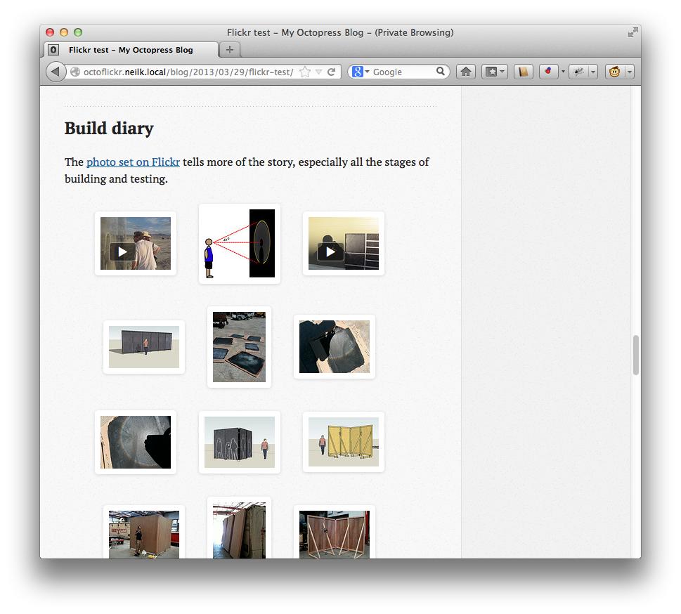

octopress-flickr
================

Display Flickr images, video, and sets in Octopress blog posts.

This does not use JavaScript in the browser to insert images - it generates the appropriate HTML right in the post. Screenshots:





## Examples

``` md
{% flickr_image 7779670214 }






```

## Install

Add these dependencies to your Octopress gemfile:

``` Rakefile
  gem 'flickraw'
  gem 'builder', '> 2.0.0'
  gem 'persistent_memoize'
```

And do a `gem install` from that directory.

Clone or otherwise obtain the files in this repository on your system. Copy or move the `.rb` and `.scss` files into
similar containing directories in your Octopress instance.

While this plugin can be used standalone it is far superior with the JavaScript framework [Fancybox](http://fancyapps.com/fancybox/).
This will give you a 'lightbox' view for your photos, with captions, as well as a slideshow view for Flickr sets. (Instructions pending).

## Flickr API Key and Secret

You're going to need to obtain a [Flickr API key and secret](http://www.flickr.com/services/developer/api/).

Then, you'll need to ensure that they are in the environment variables `FLICKR_API_KEY` and `FLICKR_API_SECRET`, 
before you run `rake generate`. 


## Tags 

This plugin adds two new tags to your Octopress install. Use `flickr_image` to insert a specific image or video. 
Use `flickr_set` to insert an entire set. The arguments for these tags are:

``` md
  

  
```

On Flickr, the **id** of the image is easily obtained from the URL. In this case the id is '3696071951'.

    http://www.flickr.com/photos/someuser/3696071951

The **preview-size** must be specified as a single-letter code. Typically you will only need to remember that `m` is medium size,
and `z` will probably fill the entire screen. Here is the full list of sizes you can use, with their common name on Flickr,
and then the maximum width or height of that image.

* **o**  : "Original", no maximum dimension
* **b**  : "Large", 1024px
* **z**  : "Medium 640", 640px
* **n**  : "Small 320", 320px
* **m**  : "Small", 240px,
* **t**  : "Thumbnail", 100px
* **q**  : "Large Square", 150px
* **s**  : "Square", 75px

The **alignment** is specified as `left`, `right`, or `center`, like the rest of Octopress.

The **caption** is a freeform string. If you want to have spaces in the caption, you may escape them directly with backslashes, or simply surround 
the entire argument with quotation marks. If your caption must also contain quotation marks, escape them with backslashes.

For photo sets, the final argument is not a caption, but controls whether the set description from Flickr is prepended to the entire set.

## Caching

This plugin caches API results and generated HTML in a `.flickr-cache` directory in your Octopress root. Usually this is exactly what you want,
because after the first time downloading info, regenerating your blog will be very quick. But, in case the information about those photos 
changes, or if you modify the plugin to generate different HTML, if you want to see the updates you need to remove the cached information. 
At the moment it is not easy to remove the caching for some photos or sets and not others.

You might want to modify your Rakefile to clean out this cache. If your Rakefile is typical, you need to change the `:clean` target to look 
like this:

``` Rakefile
desc "Clean out caches: .pygments-cache, .gist-cache, .sass-cache, .flickr-cache"
task :clean do
  rm_rf [".pygments-cache/**", ".gist-cache/**", ".sass-cache/**", "source/stylesheets/screen.css", ".flickr-cache/**"]
end
```


## Mobile 

The layout is responsive, so it should work well on tablets and mobile devices. Flickr Video may not work on iOS devices (although this is 
just a bug in the library; it's possible to obtain formats that will work on iOS).


## HTML5

This plugin generates HTML5. That means it uses tags like `<figure>` and `<figcaption>` and such. This may not look right in very old browsers, 
but it seems to work in anything better than IE7. 


## Be nice

Flickr allows you to embed images in your blog, but they request you always link back to the source image. This plugin handles that for you by
default, so don't mess with it.

Obviously using your own images is fine, but be aware that you don't always have the rights to republish images on your own blog. If you want to
be sure, ask the author's permission. Or use Flickr's [advanced search](https://www.flickr.com/search/advanced/) to find [Creative Commons](https://creativecommons.org)-licensed media. 


